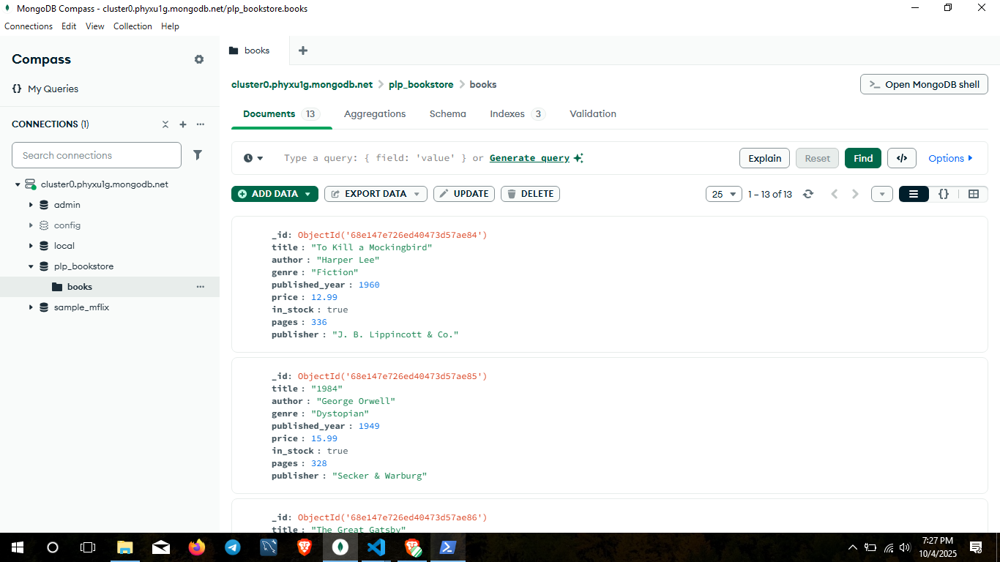

Perfect! Here’s a **polished, professional version** ready for GitHub, with badges and a table showing scripts and their purpose. Save this as `README_PROJECT.md`:

````markdown
# PLP Bookstore MongoDB Project




---

## Project Overview

This project demonstrates **MongoDB CRUD operations, indexing, and aggregation** using Node.js. It simulates a bookstore database with sample books and provides scripts to:

- Populate MongoDB Atlas with sample books.
- Perform queries: find, update, delete, sort, paginate, and aggregate.
- Check query performance using indexes and explain plans.

---

## Project Structure

| File / Folder              | Description |
|----------------------------|-------------|
| `insert_books.js`          | Script to insert sample books into MongoDB. Drops the collection if it already exists. |
| `queries.js`               | Script that performs various MongoDB operations, queries, updates, deletes, and aggregations. |
| `.env`                     | Environment variables (MongoDB URI). **This file is ignored by Git**. |
| `.gitignore`               | Specifies files/folders to ignore, such as `node_modules` and `.env`. |
| `README_PROJECT.md`        | This file – contains project explanation and instructions. |
| `MongoDB_Compass_Screenshot.png` | Screenshot showing output from the scripts in MongoDB Compass. |
| `examples/`                | Example scripts for connecting to MongoDB using shell or Node.js. and package.json  |
| `SETUP_INSTRUCTIONS.md`    | Detailed setup instructions for this project. |
| `Week1-Assignment.md`      | Assignment document included in the project. |

---

## Quick Start

### 1. Clone the repository

```bash
git clone https://github.com/PLP-MERN-Stack-Development/mongodb-data-layer-fundamentals-and-advanced-techniques-Robibiruk.git

cd mongodb-data-layer-fundamentals-and-advanced-techniques-Robibiruk
````

### 2. Install dependencies

```bash
npm install
```

### 3. Setup environment

Create a `.env` file:

```
MongoDBAtlas_URI=<mongodb-atlas-uri>
```

> Make sure `.env` is in `.gitignore` for security.

### 4. Insert sample books

```bash
node insert_books.js
```

This script:

* Connects to MongoDB Atlas.
* Drops the `books` collection if it exists.
* Inserts predefined sample books.

### 5. Run queries and updates

```bash
node queries.js
```

This script:

* Inserts books if the collection is empty.
* Finds books by genre, author, or publication year.
* Updates stock and prices.
* Deletes specific books.
* Sorts, paginates, and selects fields.
* Performs aggregation (average price, author with most books, books by decade).
* Creates indexes and checks query performance.

---

## Example MongoDB Queries

* Find all books:

```javascript
db.books.find()
```

* Find books by author:

```javascript
db.books.find({ author: "George Orwell" })
```

* Find books published after 2000:

```javascript
db.books.find({ published_year: { $gt: 2000 } })
```

* Find in-stock books:

```javascript
db.books.find({ in_stock: true })
```

---

## Notes

* Uses **MongoDB Atlas** – ensure your URI is valid.
* `insertBooksOnly()` **drops collection if it exists** before inserting.
* `queries.js` demonstrates most common MongoDB operations in Node.js.

---

## Screenshot


---

## License

This is an **educational project** for learning purposes. No license required.